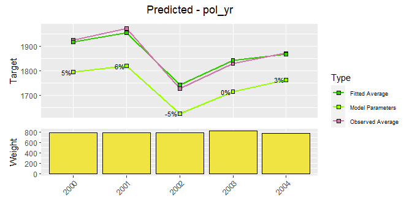
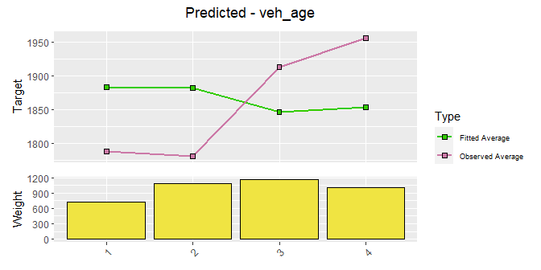
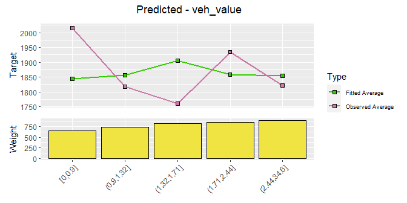

<!-- README.md is generated from README.Rmd. Please edit that file -->

# insuRglm

Provides functions for GLM modeling in insurance context, which are:

  - **Effective**, helps you get things done with one-liners
  - **Concise**, with short and self-explanatory function names
  - **Self-documenting**, keeps the workflow documented, decreases the
    need to remove previous steps

## Installation

``` r
# Make sure you have devtools installed
install.packages("devtools")

# Then you can install from this repository
devtools::install_github("realgabon/insuRglm@master", build_vignettes = TRUE)
```

## Documentation

``` r
# Each function is documented
?setup
?model_visualize

# See more in-depth usage examples in the main vignette
vignette('insuRglm')
```

## Usage

First step of using the package should always be the one-time `setup`
function.

``` r
data('sev_train')

library(insuRglm)
library(magrittr) # for the %>%

setup <- setup(
  data_train = train,
  target = 'sev',
  weight = 'numclaims',
  family = 'gamma',
  keep_cols = c('pol_nbr', 'exposure', 'premium')
)
#> [1] "Setup - OK"
#> [1] ""
#> [1] "Train Data:"
#> [1] "Number of Observations: 3699"
#> [1] "Weighted Average Target: 1873.08"
#> [1] "Max. Target: 47296.61"
#> [1] "Min. Target: 200"
#> [1] ""
```

You can explore the target, data and correlations using functions
`explore_target`, `explore_data` and `explore_corr`.

``` r
setup %>% 
  explore_target(lower_quantile = 0.05, upper_quantile = 0.95)
```

<!-- -->

``` r

setup %>% 
  explore_data(type = 'tabular', factors = c('pol_yr', 'agecat'))
#> $pol_yr
#> # A tibble: 5 x 4
#>   pol_yr weight_sum target_sum target_avg
#>   <fct>       <int>      <dbl>      <dbl>
#> 1 2000          809   1481902.      1922.
#> 2 2001          775   1236633.      1699.
#> 3 2002          814   1467416.      1886.
#> 4 2003          765   1340400.      1866.
#> 5 2004          807   1502716.      1985.
#> 
#> $agecat
#> # A tibble: 6 x 4
#>   agecat weight_sum target_sum target_avg
#>   <fct>       <int>      <dbl>      <dbl>
#> 1 1             424    962220.      2408.
#> 2 2             810   1546308.      2023.
#> 3 3             963   1621376.      1778.
#> 4 4             956   1654774.      1837.
#> 5 5             507    797327.      1638.
#> 6 6             310    447061.      1540.
```

Add or remove predictors to model formula with `factor_add` and
`factor_remove`

``` r
setup %>% 
  factor_add(pol_yr) %>% 
  factor_add(agecat)
```

Fit and visualize current model’s predictors, as well as unfitted
variables

``` r
modeling <- setup %>% 
  factor_add(pol_yr) %>% 
  factor_add(agecat) %>% 
  model_fit()


modeling %>% 
  model_visualize(factors = 'fitted')
```

<!-- --><!-- -->

``` r

modeling %>% 
  model_visualize(factors = 'unfitted')
```

<!-- --><!-- --><!-- --><!-- --><!-- -->
