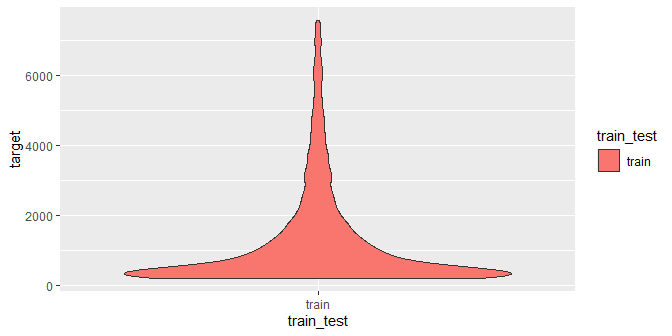

<!-- README.md is generated from README.Rmd. Please edit that file -->

# insuRglm

Generalized linear model (GLM) is a flexible generalization of ordinary
linear regression that allows for response variables that have error
distribution models other than a normal distribution. The underlying
model is still linear, but it is related to the response variable via a
link function.

This type of model is implemented in many software packages, including R
base `glm` function. However, in insurance setting, the methodology for
building GLM models is sometimes different from the usual use. While
there’s certainly an opportunity for automation to narrow down the
predictor space, the core predictors are usually selected very carefully
with almost manual approach. It is considered important to inspect every
predictor from multiple angles and make sure it has both statistical and
business significance.

This approach is usually carried out through the use of specialized
commercial software products, which offer graphical user interface and
limit the possibility of any automation or customization. **The insuRglm
package aims to provide an opensource and transparent alternative, which
can be integrated into existing R workflows, thus allowing bigger degree
of automation and customization.**

The tools provided by this package are:

  - **Effective**, helps you get things done with one-liners
  - **Concise**, with short and self-explanatory function names
  - **Self-documenting**, keeps the workflow documented, decreases the
    need to remove previous steps

## Installation

``` r
# Make sure you have devtools installed
install.packages("devtools")

# Then you can install from this repository
devtools::install_github("realgabon/insuRglm@master", build_vignettes = TRUE)
```

## Documentation

The vignette can be also found
[here](https://github.com/realgabon/insuRglm/tree/master/vignettes/insuRglm.md)

``` r
# Each function is documented
?setup
?model_visualize

# See more in-depth usage examples in the main vignette
vignette('insuRglm')
```

## Usage

First step of using the package should always be the one-time `setup`
function.

``` r
data('sev_train')

library(insuRglm)
library(magrittr) # for the %>%

setup <- setup(
  data_train = sev_train,
  target = 'sev',
  weight = 'numclaims',
  family = 'gamma',
  keep_cols = c('pol_nbr', 'exposure', 'premium')
)
#> [1] "Setup - OK"
#> [1] ""
#> [1] "Train Data:"
#> [1] "Number of Observations: 3699"
#> [1] "Weighted Average Target: 1865.06"
#> [1] "Max. Target: 46868.18"
#> [1] "Min. Target: 200"
#> [1] ""
```

You can explore the target, data and correlations using functions
`explore_target`, `explore_data` and `explore_corr`.

``` r
setup %>% 
  explore_target(lower_quantile = 0.05, upper_quantile = 0.95)
```

<!-- -->

``` r

setup %>% 
  explore_data(type = 'tabular', factors = c('pol_yr', 'agecat'))
#> $pol_yr
#> # A tibble: 5 x 4
#>   pol_yr weight_sum target_sum target_avg
#>   <fct>       <int>      <dbl>      <dbl>
#> 1 2000          791   1451350.      1925.
#> 2 2001          785   1493467.      1971.
#> 3 2002          785   1266940.      1728.
#> 4 2003          821   1421615.      1831.
#> 5 2004          779   1392400.      1871.
#> 
#> $agecat
#> # A tibble: 6 x 4
#>   agecat weight_sum target_sum target_avg
#>   <fct>       <int>      <dbl>      <dbl>
#> 1 1             423   1078124.      2661.
#> 2 2             804   1474176.      1934.
#> 3 3             944   1574173.      1763.
#> 4 4             975   1613592.      1747.
#> 5 5             512    804438.      1631.
#> 6 6             303    481270.      1667.
```

Add or remove predictors to model formula with `factor_add` and
`factor_remove`

``` r
setup %>% 
  factor_add(pol_yr) %>% 
  factor_add(agecat)
```

Fit and visualize current model’s predictors, as well as unfitted
variables

``` r
modeling <- setup %>% 
  factor_add(pol_yr) %>% 
  factor_add(agecat) %>% 
  model_fit()


modeling %>% 
  model_visualize(factors = 'fitted')
```

<!-- --><!-- -->

``` r

modeling %>% 
  model_visualize(factors = 'unfitted')
```

<!-- --><!-- --><!-- --><!-- --><!-- -->
