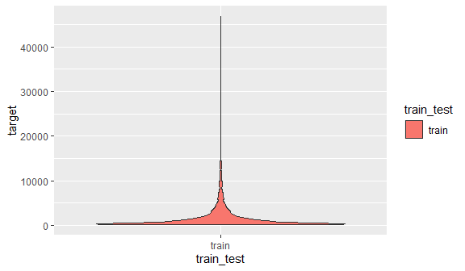
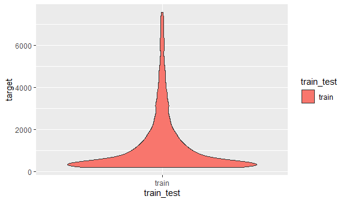
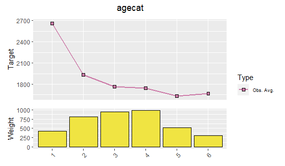
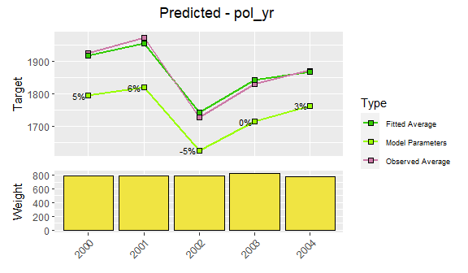
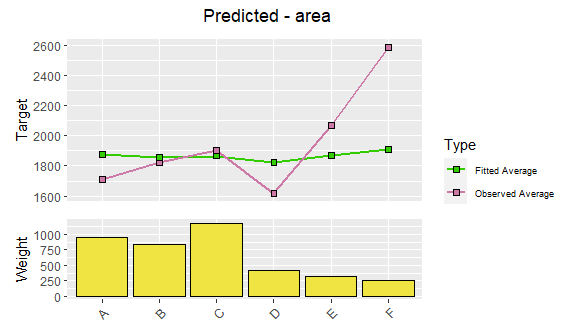
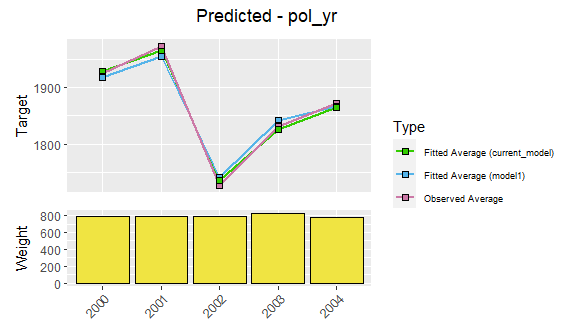
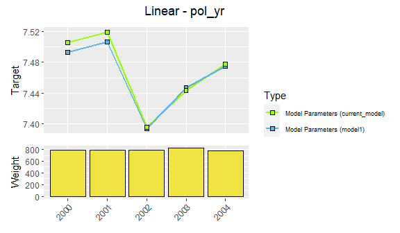
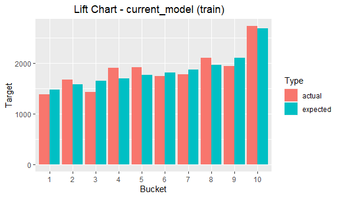
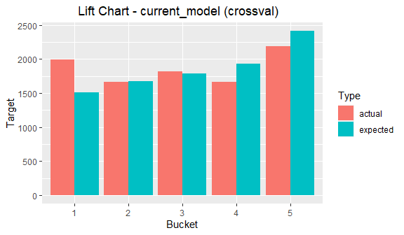

Generalized linear model (GLM) is a flexible generalization of ordinary linear regression that allows for response variables that have error distribution models other than a normal distribution. The underlying model is still linear, but it is related to the response variable via a link function.

This type of model is implemented in many software packages, including R base `glm` function. However, in insurance setting, the methodology for building GLM models is sometimes different from the usual use. While there's certainly an opportunity for automation to narrow down the predictor space, the core predictors are usually selected very carefully with almost manual approach. It is considered important to inspect every predictor from multiple angles and make sure it has both statistical and business significance.

This approach is usually carried out through the use of specialized commercial software products, which offer graphical user interface and limit the possibility of any automation or customization. **The insuRglm package aims to provide an opensource and transparent alternative, which can be integrated into existing R workflows, thus allowing bigger degree of automation and customization.**

## Data: claim severity
To illustrate the use of this package, we will use modified subset of insurance data available at http://www.acst.mq.edu.au/GLMsforInsuranceData. Our response (or target) variable will be claim severity, while the list of potential predictors includes vehicle value, vehicle age, vehicle body, area and driver's age category. Let's inspect the dataset first.


```r
data('sev_train')
head(train)
#>   pol_nbr pol_yr  exposure   premium gender agecat area veh_body veh_age   veh_value numclaims     sev
#> 1  173203   2001 0.6981520  426.5474      F      4    C    SEDAN       1 (1.71,2.44]         1  757.71
#> 2  513090   2000 0.9007529  615.9010      M      5    D    SEDAN       1 (2.44,34.6]         1 3361.73
#> 3  206556   2003 0.9938398 1270.3888      F      3    A    STNWG       3 (2.44,34.6]         1  255.59
#> 4  174815   2004 0.2956879   61.4997      F      4    C    HBACK       4     [0,0.9]         1  200.00
#> 5  288182   2002 0.6516085  338.8178      F      4    A    SEDAN       2 (1.32,1.71]         1  200.00
#> 6  264047   2003 0.7556468  820.2096      F      2    C    HBACK       3 (1.32,1.71]         1  200.00
```

## Setup your workflow
First step of using the package should always be the one-time `setup` function.


```r
setup <- setup(
  data_train = train,
  target = 'sev',
  weight = 'numclaims',
  family = 'gamma',
  keep_cols = c('pol_nbr', 'exposure', 'premium')
)
#> [1] "Setup - OK"
#> [1] ""
#> [1] "Train Data:"
#> [1] "Number of Observations: 3699"
#> [1] "Weighted Average Target: 1873.08"
#> [1] "Max. Target: 47296.61"
#> [1] "Min. Target: 200"
#> [1] ""
```

Note that if you don't specify the `simple_factors` argument, all the dataset columns other than `target`, `weight` and `keep_cols` will be considered `simple_factors`. These should have less than 255 unique values and will be converted to `factor` class. For working with other target distributions, please see the documentation of `setup` function.

## Explore the target
Basic information about the target variable is already printed to the console by the `setup` function. If we wish to explore little bit further, it is possible by using `explore_target` function.


```r
explore_target(setup)
```

<!-- -->

Some target distributions may contain a lot of zeros or low values, therefore it might be desirable to exclude them from the analysis, or limit the visualized data to specific quantile range. This is done through arguments `exlude_zero`, `lower_quantile` or `upper_quantile`.


```r
explore_target(setup, lower_quantile = 0.05, upper_quantile = 0.95)
```

<!-- -->

In case we want to see the same information in textual form, we can do it with `type = 'tabular'`.


```r
explore_target(setup, type = 'tabular', lower_quantile = 0.05, upper_quantile = 0.95)
#> $train
#>     5.0%     9.5%    14.0%    18.5%    23.0%    27.5%    32.0%    36.5%    41.0%    45.5%    50.0%    54.5%    59.0%    63.5% 
#>  200.000  200.000  200.000  290.625  353.770  353.800  389.950  410.072  476.393  565.928  662.730  779.604  915.475 1065.536 
#>    68.0%    72.5%    77.0%    81.5%    86.0%    90.5%    95.0% 
#> 1256.056 1489.090 1790.565 2211.285 2821.336 3628.201 4795.000
```

## Explore the data
We can also explore the potential predictors in either visual or tabular form. The results will show the weighted average of target variable across the levels of the corresponding predictor.

Let's look at the visual form for the single predictor.


```r
explore_data(setup, factors = 'agecat')
```

<!-- -->

Alternatively, let's inspect three predictors in tabular form. Leaving the `factors` argument blank will create these results for all available potential predictors.


```r
explore_data(setup, type = 'tabular', factors = c('pol_yr', 'agecat', 'veh_body'))
#> $pol_yr
#> # A tibble: 5 x 4
#>   pol_yr weight_sum target_sum target_avg
#>   <fct>       <int>      <dbl>      <dbl>
#> 1 2000          809   1481902.      1922.
#> 2 2001          775   1236633.      1699.
#> 3 2002          814   1467416.      1886.
#> 4 2003          765   1340400.      1866.
#> 5 2004          807   1502716.      1985.
#> 
#> $agecat
#> # A tibble: 6 x 4
#>   agecat weight_sum target_sum target_avg
#>   <fct>       <int>      <dbl>      <dbl>
#> 1 1             424    962220.      2408.
#> 2 2             810   1546308.      2023.
#> 3 3             963   1621376.      1778.
#> 4 4             956   1654774.      1837.
#> 5 5             507    797327.      1638.
#> 6 6             310    447061.      1540.
#> 
#> $veh_body
#> # A tibble: 13 x 4
#>    veh_body weight_sum target_sum target_avg
#>    <fct>         <int>      <dbl>      <dbl>
#>  1 BUS               9     11878.      1443.
#>  2 CONVT             3      6889.      2296.
#>  3 COUPE            64    149443.      2640.
#>  4 HBACK          1059   1973650.      1953.
#>  5 HDTOP           111    170859.      1622.
#>  6 MCARA            13      8675.       702.
#>  7 MIBUS            38    103497.      2787.
#>  8 PANVN            54    115617.      2221.
#>  9 RDSTR             3       785.       456.
#> 10 SEDAN          1289   2077321.      1708.
#> 11 STNWG          1008   1776875.      1862.
#> 12 TRUCK           100    209198.      2270.
#> 13 UTE             219    424381.      2086.
```

We can also get a two-way view by using the `by` argument. 


```r
explore_data(setup, factors = 'agecat', by = 'pol_yr')
```

<!-- -->


```r
explore_data(setup, type = 'tabular', factors = c('agecat', 'veh_body'), by = 'pol_yr')
#> $agecat
#> # A tibble: 30 x 5
#>    agecat pol_yr weight_sum target_sum target_avg
#>    <fct>  <fct>       <int>      <dbl>      <dbl>
#>  1 1      2000           75    157824.      2276.
#>  2 1      2001           89    199138.      2334.
#>  3 1      2002           84    233676.      2845.
#>  4 1      2003           94    199956.      2254.
#>  5 1      2004           82    171626.      2337.
#>  6 2      2000          179    389759.      2252.
#>  7 2      2001          174    272381.      1714.
#>  8 2      2002          162    305836.      2019.
#>  9 2      2003          147    278558.      1999.
#> 10 2      2004          148    299774.      2135.
#> # ... with 20 more rows
#> 
#> $veh_body
#> # A tibble: 60 x 5
#>    veh_body pol_yr weight_sum target_sum target_avg
#>    <fct>    <fct>       <int>      <dbl>      <dbl>
#>  1 BUS      2000            1       491.       491.
#>  2 BUS      2001            4      8525.      2410.
#>  3 BUS      2002            1       876.       876.
#>  4 BUS      2003            1      1033.      1033.
#>  5 BUS      2004            2       952.       476.
#>  6 CONVT    2001            1      6126.      6126.
#>  7 CONVT    2003            1       233        233 
#>  8 CONVT    2004            1       530        530 
#>  9 COUPE    2000           11     14198.      1470.
#> 10 COUPE    2001           18     51970.      2916.
#> # ... with 50 more rows
```

## Use the pipe
The `setup` function produces an object with class setup. Such object is usually the first argument of functions in this package. Moreover, most of them also return this object, with modified attributes and sub-objects. This makes the functions fully compatible with `%>%` operator, as we can see in the following example.


```r
setup %>% explore_target(type = 'tabular', n_cuts = 5)
#> $train
#>        0%       20%       40%       60%       80%      100% 
#>   200.000   345.000   491.384  1047.535  2554.470 47296.610
```
This becomes even more useful when we start with the modeling workflow. These functions will be explained shortly.

```r
setup %>% 
  factor_add(pol_yr) %>% 
  factor_add(agecat) %>% 
  model_fit()
#> [1] "Target: sev"
#> [1] "Weight: numclaims"
#> [1] "Actual Predictors: pol_yr, agecat"
#> [1] "Available Factors: gender, area, veh_body, veh_age, veh_value"
```

## Modify the model formula
Model formula defines the structure of the GLM model. The target is fixed after the creation of setup object, however, we can add predictors using `factor_add`.


```r
setup %>% 
  factor_add(pol_yr) %>% 
  factor_add(agecat)
#> [1] "Target: sev"
#> [1] "Weight: numclaims"
#> [1] "Actual Predictors: pol_yr, agecat"
#> [1] "Available Factors: gender, area, veh_body, veh_age, veh_value"
```

If we ever decide to remove the predictor from the current model formula, we can do so, without having to modify the preceding code.


```r
setup %>% 
  factor_add(pol_yr) %>% 
  factor_add(agecat) %>% 
  model_fit() %>% 
  factor_remove(agecat)
#> [1] "Target: sev"
#> [1] "Weight: numclaims"
#> [1] "Actual Predictors: pol_yr"
#> [1] "Available Factors: gender, agecat, area, veh_body, veh_age, veh_value"
```

## Fit and visualize
We can modify the model formula at any stage of the workflow, however, the model has to be fit (or re-fit) for this change to take effect.


```r
modeling <- setup %>% 
  factor_add(pol_yr) %>% 
  factor_add(agecat) %>% 
  model_fit()
```

We can visualize model predictors from the last fitted model by using `model_visualize`.


```r
modeling %>% 
  model_visualize(factors = 'fitted')
```

<!-- --><!-- -->

We can also inspect the unfitted variables.


```r
modeling %>% 
  model_visualize(factors = 'unfitted')
```

<!-- --><!-- --><!-- --><!-- --><!-- -->

## Simplify the predictors
Since the package currently supports only categorical predictors, every category of each predictor is fitted as a separate dummy variable. We can use `factor_modify` to decrease the model complexity by creating `custom_factor` or `variate`.

Custom factor will still remain categorical, but some of the levels will be merged together, based on the mapping that user provides. This mapping has to be of the same length as number of unique levels of the corresponding predictor. Assigning the same number to two different levels will merge them together. This is usually done with categorical variables where order of levels doesn't matter.

In this example, areas 'A' and 'D' will be merged together. Also areas 'E' and 'F' will be merged together with.


```r
modeling <- setup %>%
  factor_add(pol_yr) %>%
  factor_add(area) %>%
  factor_modify(area = custom_factor(area, mapping = c(1, 2, 3, 1, 4, 4))) %>%
  model_fit()
```

Variate, on the other hand, will be converted to a numeric variable, simplifying the predictor to only one coefficient (supposing the polynomial degree is 1). This is usually done with originally continuous variables.

Non-proportional variate (`type = 'non_prop')` is usually used when the distances between the categorical levels of a predictor are numerically similar. In this case a mapping vector has to be provided. These values will be substituted instead of the original values.


```r
modeling <- setup %>%
  factor_add(pol_yr) %>%
  factor_add(agecat) %>%
  factor_modify(agecat = variate(agecat, type = 'non_prop', mapping = c(1, 2, 3, 4, 5, 6))) %>%
  model_fit()
```

On the other hand, proportional variate (`type = 'prop'`) is best used when the distances between the categorical levels of a predictor are significantly different. In this case, the mapping will be created automatically.


```r
modeling <- setup %>% 
  factor_add(pol_yr) %>% 
  factor_add(veh_value) %>% 
  factor_modify(veh_value = variate(veh_value, type = 'prop')) %>% 
  model_fit()
```

However, it is required that the names of original levels contain a numeric range, as below.


```r
setup %>% 
  explore_data(type = 'tabular', factors = 'veh_value')
#> $veh_value
#> # A tibble: 5 x 4
#>   veh_value   weight_sum target_sum target_avg
#>   <fct>            <int>      <dbl>      <dbl>
#> 1 [0,0.9]            688   1318480.      2016.
#> 2 (0.9,1.32]         725   1310452.      1916.
#> 3 (1.32,1.71]        812   1383105.      1786.
#> 4 (1.71,2.44]        878   1628542.      1980.
#> 5 (2.44,34.6]        867   1388488.      1697.
```

## Save and compare
After simplifying a model predictor, it might be useful to visualize changes. We can compare the current (latest) model to a previous reference model using `model_compare`. We can use `model_save` at any point of the workflow, to save a reference model. Note, that each model has to be fit using `model_fit` before saving.


```r
modeling <- setup %>%
  factor_add(pol_yr) %>%
  factor_add(agecat) %>%
  model_fit() %>%
  model_save('model1') %>%
  factor_modify(agecat = variate(agecat, type = 'non_prop', mapping = c(1, 2, 3, 4, 5, 6))) %>%
  model_fit()
```

We can use type 1 comparison to compare actual values against the fitted values of the comparison models.


```r
modeling %>%
  model_compare(with = 'model1', type = '1')
```

<!-- --><!-- -->

In addition, type 2 comparison will compare the predictions at base levels of the comparison models


```r
modeling %>%
  model_compare(with = 'model1', type = '2')
```

<!-- --><!-- -->

## Model revert
If we ever decide to discard current model and revert to an older one (saved by `model_save`), we can do so, by using `model_revert`. This might also be useful if we want to run functions that work only on the current (latest) model in the workflow, like `model_visualize`. Moreover, this also helps to keep the workflow documented, instead of rewriting previous code.


```r
modeling <- setup %>%
  factor_add(pol_yr) %>%
  factor_add(agecat) %>%
  model_fit() %>%
  model_save('model1') %>%
  factor_modify(agecat = variate(agecat, type = 'non_prop', mapping = c(1, 2, 3, 4, 5, 6))) %>%
  model_fit() %>%
  model_revert(to = 'model1') # from now on the two lines above have no effect (but they stay documented)
```

## Beta coefficients and triangles
If we wish to inspect beta coefficients of the current (latest) model, we can do so by using `model_betas` function.


```r
modeling %>% 
  model_betas()
#> # A tibble: 10 x 5
#>    factor      actual_level estimate std_error std_error_pct
#>    <chr>       <chr>           <dbl>     <dbl> <chr>        
#>  1 (Intercept) (Intercept)   7.48       0.0791 1%           
#>  2 pol_yr      2000          0.0297     0.0874 294%         
#>  3 pol_yr      2001         -0.105      0.0884 85%          
#>  4 pol_yr      2003         -0.00620    0.0886 1430%        
#>  5 pol_yr      2004          0.0712     0.0874 123%         
#>  6 agecat      1             0.313      0.103  33%          
#>  7 agecat      2             0.133      0.0839 63%          
#>  8 agecat      4             0.0376     0.0803 213%         
#>  9 agecat      5            -0.0781     0.0965 124%         
#> 10 agecat      6            -0.147      0.115  78%
```

If we want to instead look at the differences between coefficients of each predictor, we can do so by using setting `triangles = TRUE`.


```r
modeling %>% 
  model_betas(triangles = TRUE)
#> $pol_yr
#> # A tibble: 4 x 5
#>   pol_yr `2000` `2001` `2003` `2004`
#>   <chr>  <chr>  <chr>  <chr>  <chr> 
#> 1 2000   ""     ""     ""     ""    
#> 2 2001   66%    ""     ""     ""    
#> 3 2003   247%   91%    ""     ""    
#> 4 2004   211%   50%    115%   ""    
#> 
#> $agecat
#> # A tibble: 5 x 6
#>   agecat `1`   `2`   `4`   `5`   `6`  
#>   <chr>  <chr> <chr> <chr> <chr> <chr>
#> 1 1      ""    ""    ""    ""    ""   
#> 2 2      59%   ""    ""    ""    ""   
#> 3 4      37%   88%   ""    ""    ""   
#> 4 5      30%   47%   84%   ""    ""   
#> 5 6      29%   42%   62%   183%  ""
```

## Lift charts
We can produce a lift chart showing the comparison between actual and predicted values of target variable across groups of ordered observations. This can be done either for the latest model or for all saved models in the workflow. Note that, by default, the predictions will be created once and using the full training dataset.


```r
modeling <- setup %>%
  factor_add(pol_yr) %>%
  factor_add(agecat) %>%
  model_fit() %>%
  model_save('model1') %>%
  factor_add(veh_value) %>%
  model_fit() %>%
  model_save('model2') %>%
  factor_add(veh_age) %>%
  model_fit()

modeling %>% 
  model_lift(model = 'current') # can be also 'all'
```

<!-- -->

```r

modeling %>% 
  model_lift(model = 'current', buckets = 5) 
```

<!-- -->

## Crossvalidation
Crossvalidation lets us assess the model performance more realistically, but it's computationally more intensive. Using the `model_crossval` will trigger creation of multiple datasets and re-fitting of each model structure on all of them. Each record will be scored by a model trained on a dataset that didn't include that specific record.


```r
modeling_cv <- modeling %>%
  model_crossval(cv_folds = 10, stratified = FALSE) # this is also the default
```

We can now look on the lift charts based on the crossvalidated predictions.


```r
modeling_cv %>%
  model_lift(data = 'crossval', model = 'current')
```

<!-- -->

```r

modeling_cv %>%
  model_lift(data = 'crossval', model = 'current', buckets = 5)
```

<!-- -->

## Model performance
We can use `model_performance` to compare the performance of multiple models present within the workflow. Each value on the plot represents a summarized performance metric for the corresponding model. Optionally, data can be grouped using `buckets` argument, before the mtric is computed. The plot then actually displays a comparison of multiple lift charts.


```r
modeling_cv %>%
  model_performance(data = 'crossval', buckets = 10)
```

<!-- -->

```r
  
modeling_cv %>%
  model_performance(data = 'crossval', buckets = 5)
```

<!-- -->

## Model export
If we are satisfied with the current (latest) model, we can export it and create a xlsx file. The spreadsheet will contain the charts, as well as relativities and weights for each predictor included in the model.


```r
modeling %>%
  model_export('export_test.xlsx', overwrite = TRUE)
```


