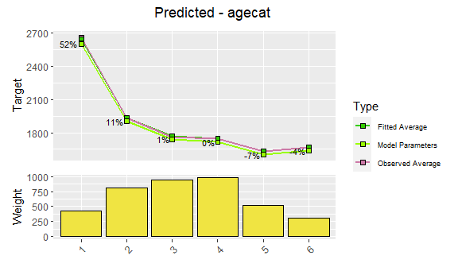
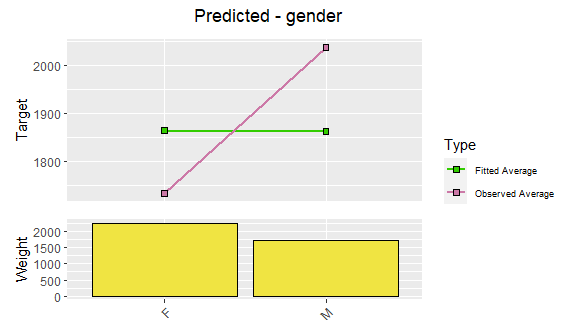
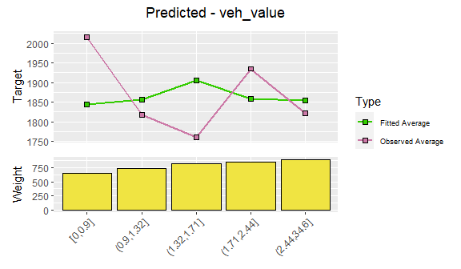
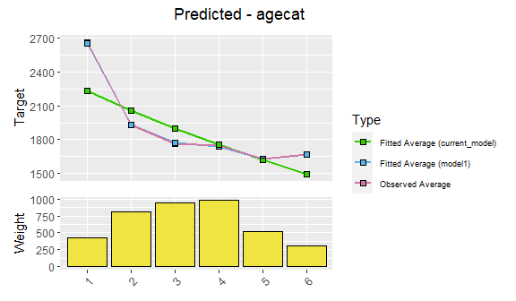
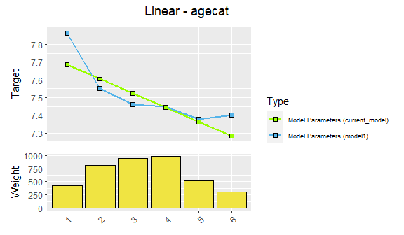
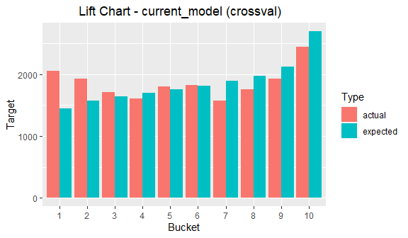
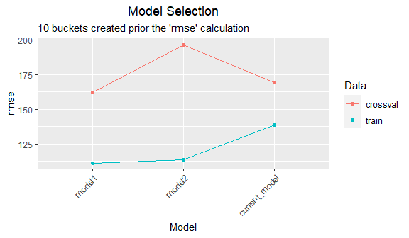
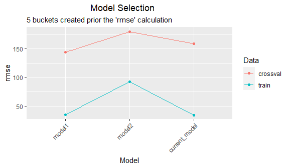

insuRglm
================

Generalized linear model (GLM) is a flexible generalization of ordinary
linear regression that allows for response variables that have error
distribution models other than a normal distribution. The underlying
model is still linear, but it is related to the response variable via a
link function.

This type of model is implemented in many software packages, including R
base `glm` function. However, in insurance setting, the methodology for
building GLM models is sometimes different from the usual use. While
there’s certainly an opportunity for automation to narrow down the
predictor space, the core predictors are usually selected very carefully
with almost manual approach. It is considered important to inspect every
predictor from multiple angles and make sure it has both statistical and
business significance.

This approach is usually carried out through the use of specialized
commercial software products, which offer graphical user interface and
limit the possibility of any automation or customization. **The insuRglm
package aims to provide an opensource and transparent alternative, which
can be integrated into existing R workflows, thus allowing bigger degree
of automation and customization.**

## Data: claim severity

To illustrate the use of this package, we will use modified subset of
insurance data available at
<http://www.acst.mq.edu.au/GLMsforInsuranceData>. Our response (or
target) variable will be claim severity, while the list of potential
predictors includes vehicle value, vehicle age, vehicle body, area and
driver’s age category. Let’s inspect the dataset first.

``` r
data('sev_train')
head(sev_train)
#>   pol_nbr pol_yr   exposure   premium gender agecat area veh_body veh_age   veh_value numclaims      sev
#> 1  195816   2000 0.11498973 411.06572      F      1    D    STNWG       1 (2.44,34.6]         1   200.00
#> 2  409083   2003 0.85694730  70.55145      M      6    A    SEDAN       4     [0,0.9]         1   390.00
#> 3  427808   2003 0.08487337  92.67664      M      1    B    HBACK       3     [0,0.9]         1   389.95
#> 4  484861   2001 0.24366872 235.18832      F      4    C    STNWG       2 (2.44,34.6]         1  1997.84
#> 5  102484   2002 0.44626968 382.87836      M      4    E    STNWG       3 (2.44,34.6]         1  1075.01
#> 6  282811   2000 0.62696783 609.22254      M      4    F      UTE       1 (2.44,34.6]         1 28012.83
```

## Setup your workflow

First step of using the package should always be the one-time `setup`
function.

``` r
setup <- setup(
  data_train = sev_train,
  target = 'sev',
  weight = 'numclaims',
  family = 'gamma',
  keep_cols = c('pol_nbr', 'exposure', 'premium')
)
#> [1] "Setup - OK"
#> [1] ""
#> [1] "Train Data:"
#> [1] "Number of Observations: 3699"
#> [1] "Weighted Average Target: 1865.06"
#> [1] "Max. Target: 46868.18"
#> [1] "Min. Target: 200"
#> [1] ""
```

Note that if you don’t specify the `simple_factors` argument, all the
dataset columns other than `target`, `weight` and `keep_cols` will be
considered `simple_factors`. These should have less than 255 unique
values and will be converted to `factor` class. For working with other
target distributions, please see the documentation of `setup` function.

## Explore the target

Basic information about the target variable is already printed to the
console by the `setup` function. If we wish to explore little bit
further, it is possible by using `explore_target` function.

``` r
explore_target(setup)
```

<!-- -->

Some target distributions may contain a lot of zeros or low values,
therefore it might be desirable to exclude them from the analysis, or
limit the visualized data to specific quantile range. This is done
through arguments `exlude_zero`, `lower_quantile` or `upper_quantile`.

``` r
explore_target(setup, lower_quantile = 0.05, upper_quantile = 0.95)
```

<!-- -->

In case we want to see the same information in textual form, we can do
it with `type = 'tabular'`.

``` r
explore_target(setup, type = 'tabular', lower_quantile = 0.05, upper_quantile = 0.95)
#> $train
#>      5.0%      9.5%     14.0%     18.5%     23.0%     27.5%     32.0%     36.5%     41.0%     45.5%     50.0%     54.5%     59.0% 
#>  200.0000  200.0000  200.0000  295.1551  353.7700  353.8000  389.9500  408.9500  480.0000  576.5054  674.6400  785.1999  920.4734 
#>     63.5%     68.0%     72.5%     77.0%     81.5%     86.0%     90.5%     95.0% 
#> 1067.6950 1261.4188 1498.5665 1773.6818 2190.2062 2798.3678 3574.3797 4755.5450
```

## Explore the data

We can also explore the potential predictors in either visual or tabular
form. The results will show the weighted average of target variable
across the levels of the corresponding predictor.

Let’s look at the visual form for the single predictor.

``` r
explore_data(setup, factors = 'agecat')
```

<!-- -->

Alternatively, let’s inspect three predictors in tabular form. Leaving
the `factors` argument blank will create these results for all available
potential predictors.

``` r
explore_data(setup, type = 'tabular', factors = c('pol_yr', 'agecat', 'veh_body'))
#> $pol_yr
#> # A tibble: 5 x 4
#>   pol_yr weight_sum target_sum target_avg
#>   <fct>       <int>      <dbl>      <dbl>
#> 1 2000          791   1451350.      1925.
#> 2 2001          785   1493467.      1971.
#> 3 2002          785   1266940.      1728.
#> 4 2003          821   1421615.      1831.
#> 5 2004          779   1392400.      1871.
#> 
#> $agecat
#> # A tibble: 6 x 4
#>   agecat weight_sum target_sum target_avg
#>   <fct>       <int>      <dbl>      <dbl>
#> 1 1             423   1078124.      2661.
#> 2 2             804   1474176.      1934.
#> 3 3             944   1574173.      1763.
#> 4 4             975   1613592.      1747.
#> 5 5             512    804438.      1631.
#> 6 6             303    481270.      1667.
#> 
#> $veh_body
#> # A tibble: 13 x 4
#>    veh_body weight_sum target_sum target_avg
#>    <fct>         <int>      <dbl>      <dbl>
#>  1 BUS               9     11759.      1430.
#>  2 CONVT             2      6656.      3328.
#>  3 COUPE            64    130713.      2338.
#>  4 HBACK          1047   1955833.      1945.
#>  5 HDTOP           111    193516.      1826.
#>  6 MCARA            14      9860.       736.
#>  7 MIBUS            39     79541.      2101.
#>  8 PANVN            52    102250.      2040.
#>  9 RDSTR             3       785.       456.
#> 10 SEDAN          1294   2057836.      1679.
#> 11 STNWG          1007   1785463.      1865.
#> 12 TRUCK           107    234310.      2367.
#> 13 UTE             212    457254.      2243.
```

We can also get a two-way view by using the `by` argument.

``` r
explore_data(setup, factors = 'agecat', by = 'pol_yr')
```

<!-- -->

``` r
explore_data(setup, type = 'tabular', factors = c('agecat', 'veh_body'), by = 'pol_yr')
#> $agecat
#> # A tibble: 30 x 5
#>    agecat pol_yr weight_sum target_sum target_avg
#>    <fct>  <fct>       <int>      <dbl>      <dbl>
#>  1 1      2000           85    255978.      3117.
#>  2 1      2001           91    285453.      3143.
#>  3 1      2002           85    160858.      2173.
#>  4 1      2003           93    184741.      2029.
#>  5 1      2004           69    191094.      2914.
#>  6 2      2000          148    235461.      1686.
#>  7 2      2001          155    327748.      2187.
#>  8 2      2002          166    243134.      1618.
#>  9 2      2003          174    377382.      2287.
#> 10 2      2004          161    290450.      1864.
#> # ... with 20 more rows
#> 
#> $veh_body
#> # A tibble: 59 x 5
#>    veh_body pol_yr weight_sum target_sum target_avg
#>    <fct>    <fct>       <int>      <dbl>      <dbl>
#>  1 BUS      2000            2      7412.      3706.
#>  2 BUS      2001            1       372.       372.
#>  3 BUS      2002            1       462.       462.
#>  4 BUS      2003            2      1523.       761.
#>  5 BUS      2004            3      1990.      1035.
#>  6 CONVT    2001            1       530        530 
#>  7 CONVT    2004            1      6126.      6126.
#>  8 COUPE    2000           19     21077.      1409.
#>  9 COUPE    2001            9     25008.      2779.
#> 10 COUPE    2002           11     20881.      2800.
#> # ... with 49 more rows
```

## Use the pipe

The `setup` function produces an object with class setup. Such object is
usually the first argument of functions in this package. Moreover, most
of them also return this object, with modified attributes and
sub-objects. This makes the functions fully compatible with `%>%`
operator, as we can see in the following example.

``` r
setup %>% explore_target(type = 'tabular', n_cuts = 5)
#> $train
#>       0%      20%      40%      60%      80%     100% 
#>   200.00   345.00   497.05  1052.15  2493.90 46868.18
```

This becomes even more useful when we start with the modeling workflow.
These functions will be explained shortly.

``` r
setup %>% 
  factor_add(pol_yr) %>% 
  factor_add(agecat) %>% 
  model_fit()
#> [1] "Target: sev"
#> [1] "Weight: numclaims"
#> [1] "Actual Predictors: pol_yr, agecat"
#> [1] "Available Factors: gender, area, veh_body, veh_age, veh_value"
```

## Modify the model formula

Model formula defines the structure of the GLM model. The target is
fixed after the creation of setup object, however, we can add predictors
using `factor_add`.

``` r
setup %>% 
  factor_add(pol_yr) %>% 
  factor_add(agecat)
#> [1] "Target: sev"
#> [1] "Weight: numclaims"
#> [1] "Actual Predictors: pol_yr, agecat"
#> [1] "Available Factors: gender, area, veh_body, veh_age, veh_value"
```

If we ever decide to remove the predictor from the current model
formula, we can do so, without having to modify the preceding code.

``` r
setup %>% 
  factor_add(pol_yr) %>% 
  factor_add(agecat) %>% 
  model_fit() %>% 
  factor_remove(agecat)
#> [1] "Target: sev"
#> [1] "Weight: numclaims"
#> [1] "Actual Predictors: pol_yr"
#> [1] "Available Factors: gender, agecat, area, veh_body, veh_age, veh_value"
```

## Fit and visualize

We can modify the model formula at any stage of the workflow, however,
the model has to be fit (or re-fit) for this change to take effect.

``` r
modeling <- setup %>% 
  factor_add(pol_yr) %>% 
  factor_add(agecat) %>% 
  model_fit()
```

We can visualize model predictors from the last fitted model by using
`model_visualize`.

``` r
modeling %>% 
  model_visualize(factors = 'fitted')
```

<!-- --><!-- -->

We can also inspect the unfitted variables.

``` r
modeling %>% 
  model_visualize(factors = 'unfitted')
```

<!-- --><!-- --><!-- --><!-- --><!-- -->

## Simplify the predictors

Since the package currently supports only categorical predictors, every
category of each predictor is fitted as a separate dummy variable. We
can use `factor_modify` to decrease the model complexity by creating
`custom_factor` or `variate`.

Custom factor will still remain categorical, but some of the levels will
be merged together, based on the mapping that user provides. This
mapping has to be of the same length as number of unique levels of the
corresponding predictor. Assigning the same number to two different
levels will merge them together. This is usually done with categorical
variables where order of levels doesn’t matter.

In this example, areas ‘A’ and ‘D’ will be merged together. Also areas
‘E’ and ‘F’ will be merged together with.

``` r
modeling <- setup %>%
  factor_add(pol_yr) %>%
  factor_add(area) %>%
  factor_modify(area = custom_factor(area, mapping = c(1, 2, 3, 1, 4, 4))) %>%
  model_fit()
```

Variate, on the other hand, will be converted to a numeric variable,
simplifying the predictor to only one coefficient (supposing the
polynomial degree is 1). This is usually done with originally continuous
variables.

Non-proportional variate (`type = 'non_prop')` is usually used when the
distances between the categorical levels of a predictor are numerically
similar. In this case a mapping vector has to be provided. These values
will be substituted instead of the original values.

``` r
modeling <- setup %>%
  factor_add(pol_yr) %>%
  factor_add(agecat) %>%
  factor_modify(agecat = variate(agecat, type = 'non_prop', mapping = c(1, 2, 3, 4, 5, 6))) %>%
  model_fit()
```

On the other hand, proportional variate (`type = 'prop'`) is best used
when the distances between the categorical levels of a predictor are
significantly different. In this case, the mapping will be created
automatically.

``` r
modeling <- setup %>% 
  factor_add(pol_yr) %>% 
  factor_add(veh_value) %>% 
  factor_modify(veh_value = variate(veh_value, type = 'prop')) %>% 
  model_fit()
```

However, it is required that the names of original levels contain a
numeric range, as below.

``` r
setup %>% 
  explore_data(type = 'tabular', factors = 'veh_value')
#> $veh_value
#> # A tibble: 5 x 4
#>   veh_value   weight_sum target_sum target_avg
#>   <fct>            <int>      <dbl>      <dbl>
#> 1 [0,0.9]            654   1259035.      2016.
#> 2 (0.9,1.32]         743   1295165.      1818.
#> 3 (1.32,1.71]        816   1368978.      1760.
#> 4 (1.71,2.44]        853   1548348.      1935.
#> 5 (2.44,34.6]        895   1554247.      1822.
```

## Save and compare

After simplifying a model predictor, it might be useful to visualize
changes. We can compare the current (latest) model to a previous
reference model using `model_compare`. We can use `model_save` at any
point of the workflow, to save a reference model. Note, that each model
has to be fit using `model_fit` before saving.

``` r
modeling <- setup %>%
  factor_add(pol_yr) %>%
  factor_add(agecat) %>%
  model_fit() %>%
  model_save('model1') %>%
  factor_modify(agecat = variate(agecat, type = 'non_prop', mapping = c(1, 2, 3, 4, 5, 6))) %>%
  model_fit()
```

We can use type 1 comparison to compare actual values against the fitted
values of the comparison models.

``` r
modeling %>%
  model_compare(with = 'model1', type = '1')
```

<!-- --><!-- -->

In addition, type 2 comparison will compare the predictions at base
levels of the comparison models

``` r
modeling %>%
  model_compare(with = 'model1', type = '2')
```

<!-- --><!-- -->

## Model revert

If we ever decide to discard current model and revert to an older one
(saved by `model_save`), we can do so, by using `model_revert`. This
might also be useful if we want to run functions that work only on the
current (latest) model in the workflow, like `model_visualize`.
Moreover, this also helps to keep the workflow documented, instead of
rewriting previous code.

``` r
modeling <- setup %>%
  factor_add(pol_yr) %>%
  factor_add(agecat) %>%
  model_fit() %>%
  model_save('model1') %>%
  factor_modify(agecat = variate(agecat, type = 'non_prop', mapping = c(1, 2, 3, 4, 5, 6))) %>%
  model_fit() %>%
  model_revert(to = 'model1') # from now on the two lines above have no effect (but they stay documented)
```

## Beta coefficients and triangles

If we wish to inspect beta coefficients of the current (latest) model,
we can do so by using `model_betas` function.

``` r
modeling %>% 
  model_betas()
#> # A tibble: 10 x 5
#>    factor      actual_level estimate std_error std_error_pct
#>    <chr>       <chr>           <dbl>     <dbl> <chr>        
#>  1 (Intercept) (Intercept)    7.45      0.0774 1%           
#>  2 pol_yr      2000           0.0459    0.0868 189%         
#>  3 pol_yr      2001           0.0595    0.0869 146%         
#>  4 pol_yr      2002          -0.0527    0.0869 165%         
#>  5 pol_yr      2004           0.0278    0.0871 313%         
#>  6 agecat      1              0.418     0.101  24%          
#>  7 agecat      2              0.104     0.0830 79%          
#>  8 agecat      3              0.0147    0.0795 541%         
#>  9 agecat      5             -0.0682    0.0950 139%         
#> 10 agecat      6             -0.0459    0.115  249%
```

If we want to instead look at the differences between coefficients of
each predictor, we can do so by using setting `triangles = TRUE`.

``` r
modeling %>% 
  model_betas(triangles = TRUE)
#> $pol_yr
#> # A tibble: 5 x 6
#>   pol_yr `2003` `2000` `2001` `2002` `2004`
#>   <chr>  <chr>  <chr>  <chr>  <chr>  <chr> 
#> 1 2003   ""     ""     ""     ""     ""    
#> 2 2000   189%   ""     ""     ""     ""    
#> 3 2001   146%   647%   ""     ""     ""    
#> 4 2002   165%   89%    78%    ""     ""    
#> 5 2004   313%   485%   278%   109%   ""    
#> 
#> $agecat
#> # A tibble: 6 x 7
#>   agecat `4`   `1`   `2`   `3`   `5`   `6`  
#>   <chr>  <chr> <chr> <chr> <chr> <chr> <chr>
#> 1 4      ""    ""    ""    ""    ""    ""   
#> 2 1      24%   ""    ""    ""    ""    ""   
#> 3 2      79%   33%   ""    ""    ""    ""   
#> 4 3      541%  25%   93%   ""    ""    ""   
#> 5 5      139%  24%   57%   115%  ""    ""   
#> 6 6      249%  28%   78%   190%  567%  ""
```

## Lift charts

We can produce a lift chart showing the comparison between actual and
predicted values of target variable across groups of ordered
observations. This can be done either for the latest model or for all
saved models in the workflow. Note that, by default, the predictions
will be created once and using the full training dataset.

``` r
modeling <- setup %>%
  factor_add(pol_yr) %>%
  factor_add(agecat) %>%
  model_fit() %>%
  model_save('model1') %>%
  factor_add(veh_value) %>%
  model_fit() %>%
  model_save('model2') %>%
  factor_add(veh_age) %>%
  model_fit()

modeling %>% 
  model_lift(model = 'current') # can be also 'all'
```

<!-- --><!-- -->

``` r

modeling %>% 
  model_lift(model = 'current', buckets = 5) 
```

<!-- -->

## Crossvalidation

Crossvalidation lets us assess the model performance more realistically,
but it’s computationally more intensive. Using the `model_crossval` will
trigger creation of multiple datasets and re-fitting of each model
structure on all of them. Each record will be scored by a model trained
on a dataset that didn’t include that specific record.

``` r
modeling_cv <- modeling %>%
  model_crossval(cv_folds = 10, stratified = FALSE) # this is also the default
```

We can now look on the lift charts based on the crossvalidated
predictions.

``` r
modeling_cv %>%
  model_lift(data = 'crossval', model = 'current')
```

<!-- -->

``` r

modeling_cv %>%
  model_lift(data = 'crossval', model = 'current', buckets = 5)
```

<!-- -->

## Model performance

We can use `model_performance` to compare the performance of multiple
models present within the workflow. Each value on the plot represents a
summarized performance metric for the corresponding model. Optionally,
data can be grouped using `buckets` argument, before the mtric is
computed. The plot then actually displays a comparison of multiple lift
charts.

``` r
modeling_cv %>%
  model_performance(data = 'crossval', buckets = 10)
```

<!-- -->

``` r
  
modeling_cv %>%
  model_performance(data = 'crossval', buckets = 5)
```

<!-- -->

## Model export

If we are satisfied with the current (latest) model, we can export it
and create a xlsx file. The spreadsheet will contain the charts, as well
as relativities and weights for each predictor included in the model.

``` r
modeling %>%
  model_export('export_test.xlsx', overwrite = TRUE)
```
